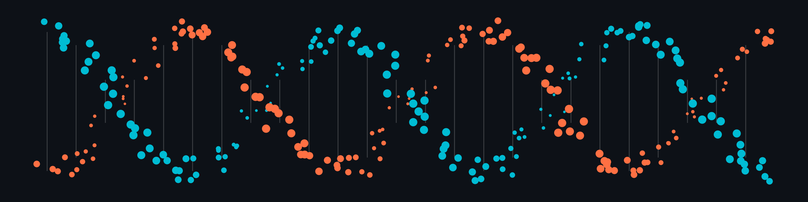

Most of my early tool choices in bioinformatics weren't really choices. The first time I mapped reads to a reference genome, I used whatever my advisor used, which was whatever their advisor used, based on a paper read in 2003. That's how a lot of these decisions get made. Not wrong exactly, but not ideal either.

This post is about a bioinformatics suite I'm glad I tried out: BBTools.

The BB stands for Brian Bushnell, developer and maintainer. He works at the [Joint Genome Institute (JGI)](https://www.jgi.doe.gov/), which processes a staggering volume of sequencing data. These tools were built by someone who needed them to work at scale, and it shows. I don't know Brian personally, but I've read his forum responses for years, and I think these tools deserve a much wider audience than they have.

Quick note on naming: the suite is sometimes called BBMap (after one tool inside it), and the official site at [bbmap.org](https://bbmap.org/) follows that convention. I encourge going to that directly rather than using search results, that seem determined to hide the site. Also, use the official site over any GitHub links in search results, which might be unofficial copies that reflect older versions of the documentation.

## The Tools

BBTools is free and open source. The suite covers a lot of ground, here are the tools you're most likely to find reason to try:

[**BBDuk**](https://bbmap.org/tools/bbduk) handles quality control (adapter trimming, quality filtering, k-mer based contamination screening). There are other solid QC tools out there ([Trimmomatic](https://trimmomatic.com/), [fastp](https://github.com/OpenGene/fastp)), but BBDuk is my current favorite. The quality-of-life features are a genuine delight, especially if you're just getting started. This is usually the first thing I run on raw reads.

[**BBMap**](https://bbmap.org/tools/bbmap) is the aligner. Fast, splice-aware, works on short and long reads. It maps reads to a reference genome using standard file formats. It also has some clever features, such as for contamination filtering. For instance, you can map your reads against whatever you *don't* want and pull out everything that doesn't hit.

[**BBMerge**](https://bbmap.org/tools/bbmerge) overlaps paired-end reads where the insert is short enough that both reads cover the same region. Merged reads can improve downstream assembly quality and meaningfully speed up subsequent analyses. I'd love to see more rigorous published comparisons to better address lingering concerns of changes to results. Those probably exist somewhere, but I haven't found something I can easily point skeptical colleagues to. Worth being thoughtful about here.

[**Reformat.sh**](https://bbmap.org/tools/reformat) is the one I have trouble explaining until someone has needed it. Format conversion, subsampling, interleaving, deinterleaving. It's unglamorous, essential, and I love it.

[**Stats.sh**](https://bbmap.org/tools/stats) gives you a quick summary of a sequence file: lengths, GC content, counts. Takes five seconds and has more than once saved me from running an analysis on a file I didn't realize was broken.

A tool I most want to call out specifically:

[**Clumpify.sh**](https://bbmap.org/tools/clumpify) — this is the one I think should be used far more widely on sequencing data. There are a couple of nuances that warrant their own post, but if you have any experience in bioinformatics, it's worth a look.

## Why I Keep Coming Back

Obviously, BBTools isn't always the right choice. Widely used tools ([BWA](https://github.com/lh3/bwa), [Trimmomatic](https://trimmomatic.com/)) are amazing bioinformatic tools, maintained by amazing people. That said, a few things keep me coming back to BBTools.

The defaults are sensible. A lot of tools ship with defaults chosen for historical reasons or because of best-practice at the time of development. BBTools was developed more recently, and the docs explain the reasoning, which is a delight. For students getting into bioinformatics, this makes BBtools wonderful for learning.

There's also less friction when tools share conventions. I don't notice it when things are going well, but I notice it when I step outside the suite and have to re-read docs to remember what a flag means.

And the documentation is unusually good. Detailed without being a wall of text, Brian is also active on the [SEQanswers forum](https://www.seqanswers.com/).

## Getting Started

Installation is simple. BBTools runs on Java, so it works across platforms without much fuss. The easiest way to get started is to Download directly from SourceForge, GitHub, or Docker Hub (all links at [bbmap.org](https://bbmap.org/)).

Or if you prefer to install in a conda environment:

``` bash
conda install -c bioconda bbtools
```

Run any tool with no arguments to see usage. Java is almost certainly something you already have, and the suite works from a laptop to an HPC with minimal reconfiguration. I prototype locally and run production jobs on HPC systems all the time and have had a great experience.

A natural starting point: try BBDuk on a set of raw reads.

``` bash
bbduk.sh in=reads.fastq.gz out=cleaned.fastq.gz ref=adapters ktrim=r k=23 mink=11 hdist=1 tpe tbo
```

There's more going on in that command than I'll unpack here (I'll do a full BBDuk post soon), but you can run it, look at the output, and start to get a feel for how the suite behaves.

Example pipelines for common bioinformatics tasks are also available in the documentation at [bbmap.org/pipelines](https://bbmap.org/pipelines). Very useful for getting oriented.

## Bonus: The Website Has More Than You'd Think

One more thing worth mentioning: the website has added a set of web-based tools that I think are underappreciated, especially for teaching.

-   Want to generate an artificial genome? [bbmap.org/services/randomgenome](https://bbmap.org/services/randomgenome).

-   Want to decode what a SAM file line actually means? [bbmap.org/services/samdecoder](https://bbmap.org/services/samdecoder).

-   There are more at [bbmap.org/webservices](https://bbmap.org/webservices). Really cool stuff.

------------------------------------------------------------------------

I'm planning deeper posts on individual tools: BBDuk, BBMap for alignment and contamination work, and some of the utilities that don't get enough attention. This post is just meant to be the introduction I wish I'd had when I was first getting started working with sequencing data.

If you end up trying it and have questions, or there's something specific in the suite you'd like me to dig into, I'd love to hear from you.
